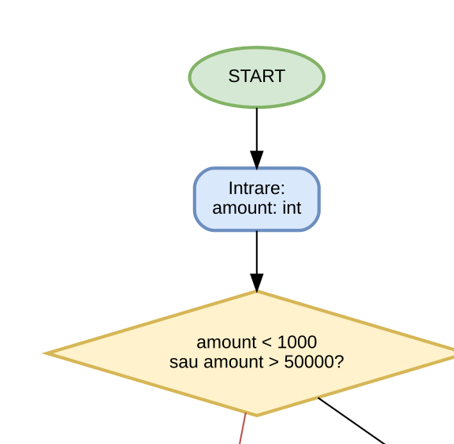
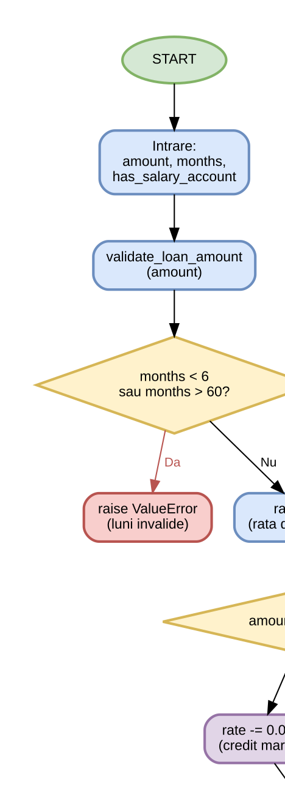
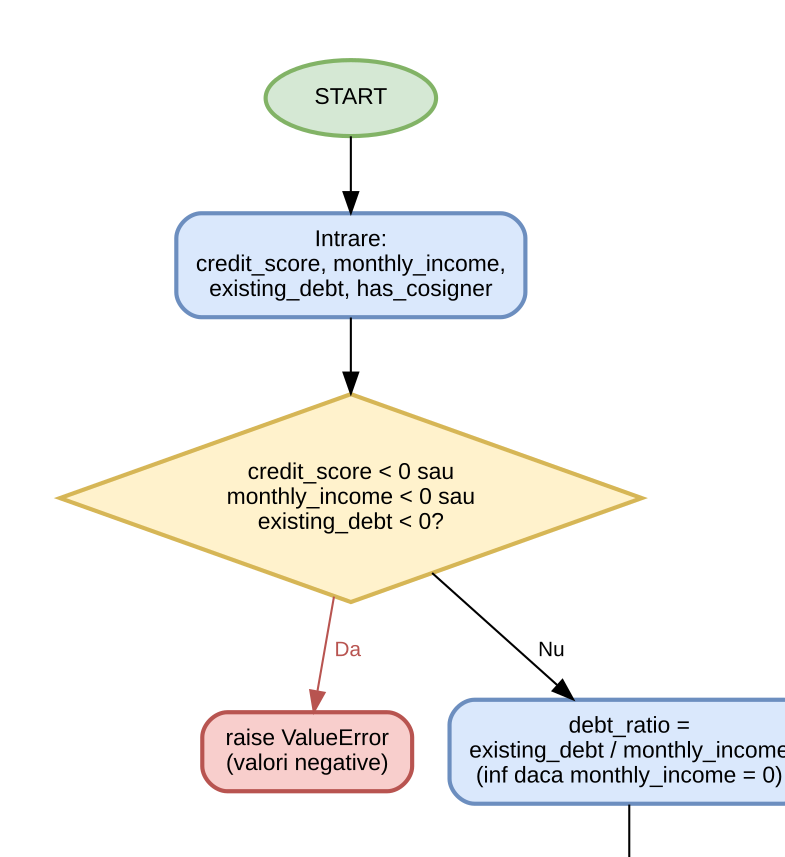

# Documentatie proiect TSS - testare unitara in Python

## 1. Introducere

Acest proiect demonstreaza testarea unitara pentru clasa `LoanEvaluator`, implementata in `main.py`, folosind framework-ul `unittest` din Python [1].  
Obiectivul este aplicarea strategiilor de proiectare a testelor cerute la curs:

- partitionare in clase de echivalenta
- analiza valorilor de frontiera
- acoperire la nivel de instructiune, decizie si conditie
- circuite independente (basis path)
- analiza rezultatelor unui generator de mutanti
- adaugarea de teste pentru omorarea a 2 mutanti neechivalenti ramasi in viata

## 2. Descrierea aplicatiei testate

Clasa `LoanEvaluator` contine trei functionalitati:

1. `validate_loan_amount(amount)`:
- valideaza intervalul `[1000, 50000]`
- clasifica suma in `small`, `medium`, `large`

2. `calculate_interest_rate(amount, months, has_salary_account)`:
- foloseste reguli pentru suma, perioada si cont de salariu
- returneaza dobanda finala rotunjita

3. `evaluate_application(credit_score, monthly_income, existing_debt, has_cosigner)`:
- decide `approved`, `manual_review` sau `rejected`
- foloseste conditii combinate pe scor, venit, grad de indatorare si codebitor

### 2.1 Diagrame flowchart

#### validate_loan_amount


#### calculate_interest_rate


#### evaluate_application


## 3. Strategii de testare aplicate

### 3.1 Partitionare in clase de echivalenta

Exemple de clase pentru `validate_loan_amount`:

- invalida sub minim: `500`
- valida mica: `3000`
- valida medie: `12000`
- valida mare: `35000`
- invalida peste maxim: `70000`

Implementare: `tests/test_loan_evaluator_core.py`.

### 3.2 Analiza valorilor de frontiera

Frontiere testate:

- minim: `999`, `1000`, `1001`
- maxim: `49999`, `50000`, `50001`
- frontiera interna de clasificare: `5000` (test suplimentar)

Implementare:

- `tests/test_loan_evaluator_core.py`
- `tests/test_loan_evaluator_additional.py`

### 3.3 Acoperire la nivel de instructiune

Testul `test_statement_coverage_for_interest_rate` executa instructiunile principale ale calculului de dobanda, inclusiv reduceri cumulative.

### 3.4 Acoperire la nivel de decizie

Ramurile decizionale pentru perioada sunt traversate prin:

- `months <= 12`
- `months >= 36`

### 3.5 Acoperire la nivel de conditie

Sunt exercitate combinatii relevante pentru expresiile booleene:

- `credit_score < 550` (adevarat/fals)
- `credit_score >= 700 or has_cosigner`
- `monthly_income >= 5000`
- `debt_ratio <= 0.4` si `debt_ratio <= 0.5`

### 3.6 Circuite independente (basis path)

Pentru `evaluate_application` au fost alese trasee independente:

1. respingere imediata (`credit_score < 550`)
2. aprobare (`venit mare`, `debt_ratio <= 0.4`, scor mare)
3. review manual (`venit mare`, fara codebitor, scor < 700)
4. review manual (`venit mediu`, cu codebitor)
5. respingere pe cazuri reziduale


## 4. Configuratia de rulare

### 4.1 Configuratia hardware

Date extrase din mediul de lucru curent:

- CPU: `AMD Ryzen 9 7900 12-Core Processor` (12 nuclee / 24 thread-uri)
- RAM: `31.74 GB`
- Sistem: `LENOVO 90UY00ADRI`

### 4.2 Configuratia software

- OS: `Microsoft Windows 11 Pro`, versiune `10.0.26200`, arhitectura `64-bit`
- Python: `3.13.5`
- pip: `25.1.1`
- Git: `2.50.1.windows.1`
- Framework testare: `unittest` (stdlib Python)

### 4.3 Masina virtuala

- nu a fost folosita masina virtuala
- rularea s-a facut local, in mediul host

## 5. Fragmente de cod relevante

### 5.1 Fragment cod productie (`main.py`)

```python
if monthly_income >= 5_000 and debt_ratio <= 0.4:
    if credit_score >= 700 or has_cosigner:
        return "approved"
    return "manual_review"
```

### 5.2 Fragment cod teste suplimentare (`tests/test_loan_evaluator_additional.py`)

```python
def test_amount_boundary_exactly_5000_is_still_small(self) -> None:
    self.assertEqual("small", self.evaluator.validate_loan_amount(5_000))
```

```python
def test_application_is_rejected_without_cosigner_on_medium_income(self) -> None:
    result = self.evaluator.evaluate_application(
        credit_score=620,
        monthly_income=3_500,
        existing_debt=1_000,
        has_cosigner=False,
    )
    self.assertEqual("rejected", result)
```

## 6. Rulare si capturi de ecran

### 6.1 Comenzi folosite

```powershell
.\myvenv\Scripts\python.exe -m unittest discover -s tests -v
.\myvenv\Scripts\python.exe mutation_runner.py
```

### 6.2 Rezultate obtinute

- Teste unitare: `17` teste, toate `OK`
- Mutatii:
- `core suite`: `Killed = 1`, `Survived = 2`
- `core + additional tests`: `Killed = 3`, `Survived = 0`


## 7. Comparatie rezultate/tool-uri (tabelar)

| Criteriu | unittest | mutation_runner.py |
|---|---|---|
| Scop principal | Validare functionala fata de expected outputs | Evaluare putere teste prin mutanti |
| Tip rezultat | PASS/FAIL pe teste | KILLED/SURVIVED pe mutanti |
| Granularitate | per test | per mutant |
| Valoare in proiect | confirma corectitudinea implementarii | confirma sensibilitatea suitei la defecte |
| Rezultat in acest proiect | 17/17 teste trecute | de la 1/3 mutanti omorati la 3/3 |

## 8. Interpretare rezultate

1. Suita de baza detecteaza defectele majore, dar nu toate diferentele subtile de frontiera.
2. Mutantii `M1` si `M2` au supravietuit initial, indicand goluri de testare:
- frontiera exacta `5000`
- regula de codebitor pe venit mediu
3. Doua teste suplimentare au inchis exact aceste goluri.
4. Dupa extindere, toti mutantii definiti au fost omorati (`100% kill rate` in setul de mutanti modelat).

## 9. Limitari si imbunatatiri

- generatorul de mutanti este unul didactic, nu un tool industrial complet
- nu este inclusa acoperire instrumentata automat (ex. `coverage.py`)

Imbunatatiri posibile:

1. integrare `coverage.py` pentru metrici line/branch
2. integrare tool dedicat de mutation testing (de ex. `mutmut`) daca mediul permite instalarea
3. automatizare in CI (GitHub Actions)

